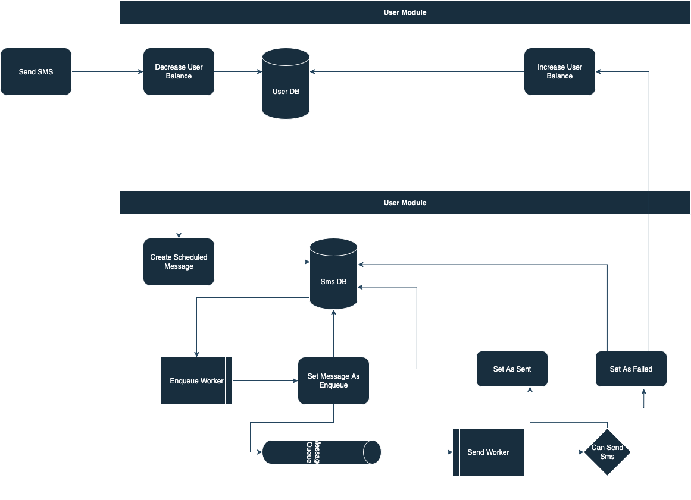

## SMS Gateway

### Dependencies:

- Go 1.24
- PostgresSQL
- Redis

#### Architecture:

- Clean Architecture (Hexagonal)

#### Design

- Domain Driven Design

#### Domain:

- **User**: Responsible for actions on `User` entity
- **Sms**: Responsible for action on `Sms` entity

### Endpoints:

| Method | Path                        | Description                |
|--------|-----------------------------|----------------------------|
| GET    | `/metrics`                  | Metrics of the application |
| GET    | `/swagger`                  | Swagger documentations     |
| GET    | `/healthz`                  | Health check endpoint      |
| GET    | `/healthz`                  | Health check endpoint      |
| POST   | `/api/user`                 | Create new user            |
| GET    | `/api/user/{id}`            | Get user by ID             |
| POST   | `/api/user/{id}/balance`    | Increases user balance     |
| GET    | `/api/user/{id}/sms`        | Get user messages by ID    |
| POST   | `/api/user/{id}/sms/single` | Sent single SMS            |
| POST   | `/api/user/{id}/sms/bulk`   | Send bulk SMS              |

### Send SMS Flow

